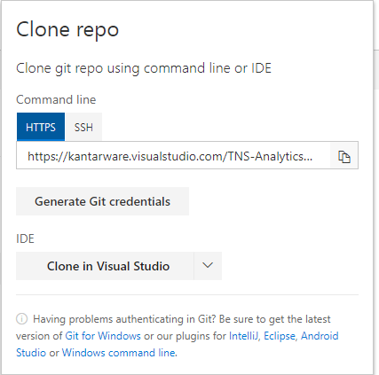

# ValueManager R functions on Kantarware
The aim of `VMinR` is to provide a set of usfull R-functions to ValueManager modellers.

## Installation
If you want to install the BeastDevTools package, then you will need the following packages:

* devtools
* git2r

The only other thing you will need to install packages from TNS-AnalyticsDE-VMTools are kantarware generated git credentials. 
If you haven't already generated these from another project then click [here](https://kantarware.visualstudio.com/TNS-AnalyticsDE-VMTools/_git/VMinR_Test). 
Once you are on this screen, you will see a "Clone" button towards the top-right corner of the screen. Click on the button, and you will see this pop-up:




Click on "Generate Git Credentials" and then enter a username and password (it doesn't have to be the same as your Kantar credentials). At this point you should have everything you need to install packages off TNS-AnalyticsDE-VMTools

From there: Go to R (e.g. using RStudio) and run the following script to install the package `VMinR` on your local machine:

```
install.packages(c('devtools', 'git2r'))
remove.packages("VMinR")

creds <- git2r::cred_user_pass("USER NAME", "PASSWORD")

devtools::install_git("https://kantarware.visualstudio.com/TNS-AnalyticsDE-VMTools/_git/VMinR_Test", 
                      credentials = creds)

library(VMinR)

hello()
```

## Functionality
The package currently contains basic import and simulation functions for ValueDriver/ValuePricer dat/def-files. 
It also contains some basic import functions for the most often used Sawtooth files. 
Apart from that functions to create a heatmap for ValuePricer studies is included.

For details please refer to `VMinR.pdf` in  [VMinR_test/doc](https://kantarware.visualstudio.com/TNS-AnalyticsDE-VMTools/_git/VMinR_Test?path=%2Fdoc)

### ValueDriver
* get_DriverData
* VD.read_def
* VD.computeShares

### ValuePricer
* get_PricerData
* VP.read_def
* VP.computeShares

### read/write functions
* readCHO
* readDAT
* writeCHO

### Concept Optimization (ISBC)
* calibEXE
* summary_calibEXE
* prodAcceptance
* ConceptOpt_ISBC

### other functions
* covertSSItoDesign
* correlation_HeatMap
* hello

## Bug Report

If you find any bugs in the package, then please get back to me ([eMail](mailto:maximilian.rausch@tns-infratest.com)) giving as much detail as possible into what is breaking.
